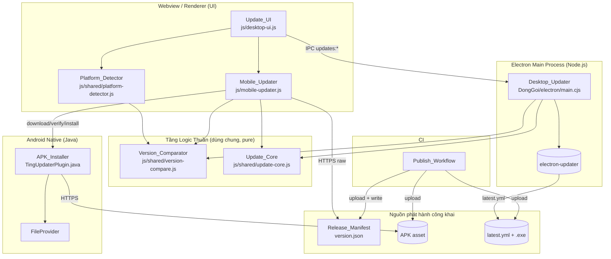
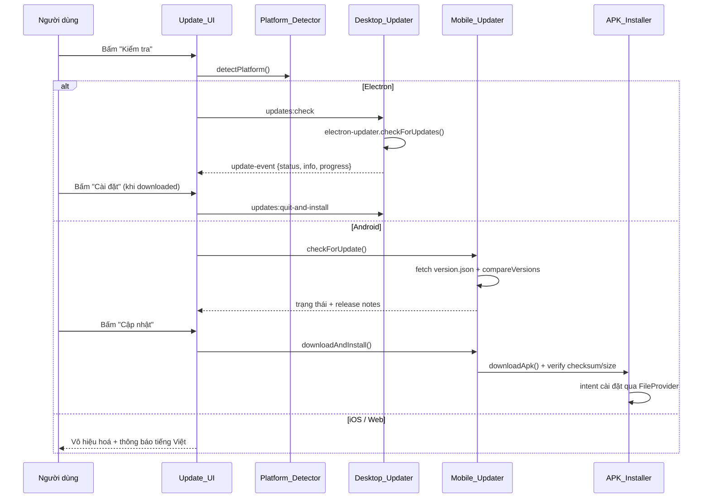

# Design Document
<!-- Tài liệu Thiết kế -->

## Overview
<!-- Tổng quan -->

Tài liệu này mô tả thiết kế cho **Update_System** — hệ thống tự cập nhật trong app (in-app update)
đa nền tảng của "Ting!". Mục tiêu là cung cấp một điểm vào thống nhất trong Cài đặt để người dùng trên
desktop Windows (Electron) và Android (APK cài ngoài, Capacitor) có thể kiểm tra, tải, và cài đặt bản
cập nhật, trong khi iOS/web suy giảm nhẹ nhàng (degrade gracefully).

Thiết kế xoay quanh việc **tách phần logic thuần (pure logic) khỏi phần I/O và UI**, để:

- Cùng một **Version_Comparator** và quy tắc phân loại trạng thái được dùng chung giữa Electron main
  process (Node.js) và webview Android (trình duyệt), tránh phân kỳ hành vi giữa hai nền tảng.
- Phần logic thuần (so sánh phiên bản, phân loại trạng thái, tính khoảng cách phiên bản, làm sạch
  thông báo lỗi, cắt nhật ký, kiểm tra tính toàn vẹn, kiểm soát tần suất Background_Check, kiểm tra
  origin URL) có thể kiểm thử bằng property-based testing mà không cần I/O thật.
- Phần I/O (electron-updater, tải APK, gọi trình cài đặt native) và UI được kiểm thử bằng unit test
  ví dụ và integration test.

Thiết kế **tái sử dụng tối đa** hạ tầng sẵn có: `electron-updater` (`package.json` đã cấu hình publish
GitHub), các hàm `compareVersions`/`normalizeVersion`/`sanitizeUpdateMessage`/`appendUpdateLog` trong
`DongGoi/electron/main.cjs`, mẫu Capacitor plugin native (`TingNotificationsPlugin`), FileProvider đã
khai báo trong `AndroidManifest.xml`, và luồng render Cài đặt trong `js/desktop-ui.js`.

### Kết quả nghiên cứu (Research Findings)

Khảo sát codebase hiện tại cho thấy:

1. **Desktop (Electron)** đã có sẵn `electron-updater@^6.8.3` và cấu hình `build.publish` trỏ tới
   GitHub (`owner: taorain01`, `repo: 8.-Ting`). Đã có `setupAutoUpdater()`, `getAutoUpdater()`,
   `checkGithubRelease()`, cùng IPC `updates:check`, `updates:get-log`, `updates:quit-and-install`.
   Điểm thiếu: GitHub release chưa publish `latest.yml` nên `electron-updater` không phân giải được bản
   cập nhật đầu-cuối. Hiện `checkGithubRelease()` chỉ gọi REST API `releases/latest` để hiển thị thông
   tin, chưa nối vào luồng tải/cài của `electron-updater`.
2. **so sánh phiên bản** đang nằm trong main process (`compareVersions`, `normalizeVersion`). Android
   chạy trong webview nên cần cùng logic này ở tầng JS dùng chung.
3. **Android (Capacitor 7.4.3)**: `applicationId = app.ting.manager`, `versionCode = 3`,
   `versionName = "1.3"`. Đã khai báo FileProvider `${applicationId}.fileprovider` với `file_paths.xml`.
   Đã có mẫu plugin native (`TingNotificationsPlugin`) đăng ký trong `MainActivity.onCreate()`. Chưa có
   quyền `REQUEST_INSTALL_PACKAGES` và chưa có plugin cập nhật.
4. **Phát hiện nền tảng**: web app dùng `window.electronAPI?.isElectron` (Electron) và
   `window.Capacitor?.getPlatform?.()` / `isNativePlatform()` (Capacitor). Đây là nền tảng cho
   Platform_Detector.
5. **Lưu trữ**: desktop dùng `electron-store` (khoá `updateLog`, giữ 10 mục). Android sẽ dùng
   `localStorage` của webview cho nhật ký và mốc Background_Check.
6. **Bảo mật**: `sanitizeUpdateMessage()` đã lọc `set-cookie`, token `gh[opsu]_...`. Không có token nào
   được nhúng vào app phân phối (token GitHub chỉ dùng ở CI cho Publish_Workflow).

### Phạm vi (Scope)

- **Trong phạm vi**: Update_UI thống nhất; Version_Comparator dùng chung; hoàn thiện cập nhật desktop
  qua `latest.yml`; cập nhật Android qua `version.json` + tải + kiểm tra toàn vẹn + cài đặt; quyền &
  tích hợp native Android; xử lý lỗi & trạng thái; Background_Check; Publish_Workflow; bản địa hoá
  tiếng Việt.
- **Ngoài phạm vi**: tự cập nhật iOS (App Store lo); ký (signing) APK/EXE (dựa vào hạ tầng có sẵn);
  thay đổi Firestore rules hay mã hoá client-side.

## Architecture
<!-- Kiến trúc -->

### Sơ đồ thành phần tổng thể



### Luồng kiểm tra & cập nhật theo nền tảng



### Nguyên tắc kiến trúc

1. **Pure core, impure edges**: mọi quyết định (có bản cập nhật không? toast hay dialog? thông báo lỗi
   nào? giữ mục log nào?) đều là hàm thuần trong `js/shared/*`. Electron main dùng `require(...)`,
   webview nạp bằng `<script>`; module viết theo UMD nhẹ để chạy được cả hai môi trường.
2. **Một nguồn sự thật cho so sánh phiên bản**: `Version_Comparator` là module chuẩn duy nhất; các bản
   sao `compareVersions`/`normalizeVersion` trong `main.cjs` sẽ được refactor để gọi module dùng chung.
3. **Không secret trong app phân phối**: app đọc `version.json` và tải APK/`latest.yml` không cần xác
   thực. Token chỉ tồn tại trong môi trường CI của Publish_Workflow.
4. **Suy giảm nhẹ nhàng**: Platform_Detector quyết định năng lực; nền tảng không hỗ trợ chỉ hiển thị
   phiên bản và (với web) liên kết tải thủ công, không phát sinh lỗi.

## Components and Interfaces
<!-- Thành phần và Giao diện -->

### 1. Version_Comparator (`js/shared/version-compare.js`)

Module thuần, không phụ thuộc DOM/Node, dùng chung mọi nền tảng.

```js
// Chuẩn hoá chuỗi phiên bản: bỏ tiền tố "v", cắt metadata build, giữ các đoạn số dạng chấm.
function normalizeVersion(value: string): string;

// So sánh 2 phiên bản: trả về 1 (left>right), 0 (bằng), -1 (left<right).
// Đoạn thiếu coi như 0; chuỗi không có đoạn số coi như "0.0.0".
function compareVersions(left: string, right: string): -1 | 0 | 1;

// Phân loại trạng thái cập nhật dựa trên so sánh.
// installed >= latest => 'up-to-date'; latest > installed => 'update-available'.
function classifyUpdateStatus(installed: string, latest: string): 'up-to-date' | 'update-available';

// Khoảng cách phiên bản (số nguyên không âm) dùng cho ngưỡng toast/dialog.
// Desktop: dựa trên đoạn số phiên bản; Android: dựa trên version code (số nguyên).
function versionDistance(installed: string | number, latest: string | number): number;
```

### 2. Update_Core (`js/shared/update-core.js`)

Gom các quyết định logic thuần khác, tách khỏi I/O.

```js
// Làm sạch thông báo lỗi: thay token/credential/response header bằng thông báo tiếng Việt chung.
function sanitizeUpdateMessage(message: string): string;

// Cắt nhật ký cập nhật: chèn mục mới nhất lên đầu, giữ tối đa 10 mục gần nhất.
function appendUpdateLogEntry(log: UpdateLogEntry[], entry: UpdateLogEntry): UpdateLogEntry[];

// Kiểm tra & phân tích Release_Manifest; trả về {ok, manifest?, error?}.
function parseReleaseManifest(raw: unknown): { ok: boolean; manifest?: ReleaseManifest; error?: string };

// Quyết định kiểu thông báo Background_Check theo khoảng cách phiên bản.
// distance <= 3 => 'toast'; distance > 3 => 'dialog'.
function decideNotificationKind(distance: number): 'toast' | 'dialog';

// Kiểm soát tần suất: chỉ cho phép Background_Check nếu đã qua >= 24h kể từ lần cuối.
function shouldRunBackgroundCheck(lastCheckAt: number | null, now: number, enabled: boolean): boolean;

// Kiểm tra URL thuộc origin cho phép (raw.githubusercontent.com + miền tải asset GitHub).
function isAllowedReleaseUrl(url: string): boolean;

// Quyết định kết quả kiểm tra toàn vẹn của bản tải.
function verifyArtifactIntegrity(
  actual: { size: number; sha256: string },
  expected: { size: number; sha256: string }
): boolean;
```

### 3. Platform_Detector (`js/shared/platform-detector.js`)

```js
type Platform = 'electron' | 'android' | 'ios' | 'web';

// Xác định nền tảng lúc chạy từ window.electronAPI/isElectron và window.Capacitor.
function detectPlatform(env: PlatformEnv): Platform;

// Năng lực cập nhật của nền tảng: có bật hành động "Kiểm tra"/"Cập nhật" hay không.
function updateCapability(platform: Platform): {
  canCheck: boolean;
  disabledMessage: string | null; // tiếng Việt, ví dụ "Cập nhật qua App Store"
};
```

`detectPlatform` nhận một object `env` (bơm phụ thuộc từ `window`) để kiểm thử được thuần tuý.

### 4. Desktop_Updater (`DongGoi/electron/main.cjs`)

Bọc `electron-updater`. Refactor để dùng Version_Comparator/Update_Core dùng chung.

- `getAutoUpdater()`, `setupAutoUpdater()` — giữ nguyên vai trò, đăng ký event handler.
- Sau khi Publish_Workflow publish `latest.yml`, luồng chuyển sang dùng
  `autoUpdater.checkForUpdates()` / `downloadUpdate()` / `quitAndInstall()` thay cho chỉ gọi REST API.
- IPC (giữ nguyên tên): `updates:check`, `updates:get-log`, `updates:quit-and-install`.
- Phát `update-event` qua `sendToRenderer` với payload `{status, message, info, progress, log}`.
- Nhật ký lưu bằng `electron-store` khoá `updateLog`, cắt bằng `appendUpdateLogEntry`.

### 5. Mobile_Updater (`js/mobile-updater.js`)

Chạy trong webview Android. Điều phối kiểm tra/tải/cài.

```js
async function checkForUpdate(): Promise<UpdateInfo>;      // fetch version.json (HTTPS, no auth)
async function downloadAndInstall(info: UpdateInfo): Promise<void>; // gọi APK_Installer
function onProgress(cb: (percent: number) => void): void;  // tiến độ tải
```

- Lấy `version.json` từ URL cố định `https://raw.githubusercontent.com/taorain01/ting-releases/main/version.json`.
- So sánh `versionCode` bằng Version_Comparator, phân loại trạng thái.
- Uỷ quyền tải + kiểm tra toàn vẹn + cài đặt cho APK_Installer (native). Nhật ký/mốc lưu localStorage.

### 6. APK_Installer — Capacitor plugin native (`TingUpdaterPlugin.java`)

Đăng ký trong `MainActivity.onCreate()` giống `TingNotificationsPlugin`.

```java
@PluginMethod void downloadApk(PluginCall call);       // {url, expectedSha256, expectedSize}
@PluginMethod void installApk(PluginCall call);        // {filePath} -> intent cài đặt qua FileProvider
@PluginMethod void ensureInstallPermission(PluginCall call); // mở màn hình "unknown sources" nếu thiếu
@PluginMethod void cleanupApk(PluginCall call);        // xoá APK đã tải
```

- Tải qua HTTPS (chỉ origin cho phép), phát tiến độ về JS.
- Xác minh SHA-256 + kích thước trước khi mời cài đặt; thất bại thì xoá file, không khởi chạy installer.
- Cài đặt: `Intent.ACTION_VIEW`/`ACTION_INSTALL_PACKAGE` với URI qua FileProvider
  `${applicationId}.fileprovider`, cấp `FLAG_GRANT_READ_URI_PERMISSION`.
- Nếu thiếu quyền cài gói (`canRequestPackageInstalls()` = false) → mở
  `Settings.ACTION_MANAGE_UNKNOWN_APP_SOURCES` cho package của app.

### 7. Update_UI (`js/desktop-ui.js`)

- `renderUpdateStatus()`, `renderUpdateLog()`, `renderSettings()` — mở rộng khu "Phiên bản" để hoạt
  động trên cả desktop & Android dựa trên Platform_Detector.
- Trạng thái: `idle | checking | update-available | downloading | downloaded/ready | up-to-date | error | offline`.
- Hành động: "Kiểm tra", "Cập nhật"/"Cài đặt" (khoá khi đang tải để chỉ 1 tiến trình tải).
- Background_Check: hiển thị toast (khoảng cách ≤ 3) hoặc dialog nổi (> 3 hoặc khi mở app).

### 8. Publish_Workflow (CI — `.github/workflows` hoặc script)

- Desktop: build `.exe` + `latest.yml` → upload lên nguồn phát hành desktop.
- Android: build APK → tính SHA-256 + kích thước → ghi `version.json` (Latest_Version, versionCode,
  release notes, URL tải APK, Min_Supported_Version) → upload APK + `version.json` lên Releases_Repository.
- Nếu thiếu artifact cần thiết → dừng, không sửa `version.json`, báo cáo artifact thiếu.

## Data Models
<!-- Mô hình Dữ liệu -->

### ReleaseManifest (`version.json`)

```jsonc
{
  "latestVersion": "1.4.0",        // Latest_Version (semantic)
  "versionCode": 4,                 // dùng so sánh trên Android
  "releaseNotes": "…tiếng Việt…",  // ghi chú phát hành
  "apkUrl": "https://github.com/taorain01/ting-releases/releases/download/v1.4.0/ting-1.4.0.apk",
  "apkSize": 12345678,              // byte, kiểm tra toàn vẹn
  "apkSha256": "abc123…",           // APK_Checksum
  "minSupportedVersion": 2          // Min_Supported_Version (theo versionCode)
}
```

### UpdateStatus / UpdateInfo (runtime)

```ts
type UpdateStatusKind =
  | 'idle' | 'checking' | 'update-available' | 'downloading'
  | 'downloaded' | 'up-to-date' | 'error' | 'offline';

interface UpdateInfo {
  currentVersion: string;
  latestVersion: string;
  releaseNotes?: string;
  releaseUrl?: string;
  source: 'github' | 'manifest';
  distance?: number;          // khoảng cách phiên bản
}

interface DownloadProgress { percent: number; transferred?: number; total?: number; }
```

### UpdateLogEntry (giữ tối đa 10 mục)

```ts
interface UpdateLogEntry {
  version: string;
  status: string;    // 'checking' | 'available' | 'downloaded' | 'error' | ...
  source?: 'github' | 'manifest';
  message?: string;  // đã qua sanitizeUpdateMessage
  date: string;      // định dạng vi-VN
}
```

### BackgroundCheckState

```ts
interface BackgroundCheckState {
  enabled: boolean;        // mặc định true
  lastCheckAt: number | null; // epoch ms, dùng cho ngưỡng 24h
}
```

Lưu trữ: desktop `electron-store`; Android `localStorage`.

## Correctness Properties
<!-- Thuộc tính Đúng đắn -->

*Một property (thuộc tính) là đặc điểm hoặc hành vi phải luôn đúng qua mọi lần thực thi hợp lệ của hệ
thống — về bản chất là một phát biểu hình thức về những gì hệ thống phải làm. Property đóng vai trò cầu
nối giữa đặc tả cho con người đọc và các bảo đảm đúng đắn máy có thể kiểm chứng.*

Các property dưới đây rút ra từ prework, đã qua bước loại bỏ trùng lặp; mỗi property tương ứng một
property-based test (tối thiểu 100 vòng lặp). Các tiêu chí thuộc loại EXAMPLE / EDGE_CASE / INTEGRATION
/ SMOKE được kiểm thử bằng chiến lược tương ứng ở mục Testing Strategy, không liệt kê ở đây.

### Property 1: Tính đúng đắn và phản đối xứng của Version_Comparator

*For any* hai chuỗi phiên bản `a` và `b` (bao gồm chuỗi có số đoạn khác nhau và chuỗi không chứa đoạn
số hợp lệ), `compareVersions(a, b)` trả về giá trị trong `{-1, 0, 1}` khớp với so sánh từ điển của các
đoạn số đã chuẩn hoá (đoạn thiếu coi là 0, chuỗi không phân tích được coi là `0.0.0`), VÀ luôn thoả
`compareVersions(a, b) === -compareVersions(b, a)`.

**Validates: Requirements 2.1, 2.3, 2.4, 2.5**

### Property 2: Chuẩn hoá phiên bản không đổi kết quả so sánh

*For any* chuỗi phiên bản `x`, việc thêm tiền tố `"v"` và/hoặc phần metadata build ở đuôi (ví dụ
`"+build.5"`) không làm thay đổi kết quả so sánh: `compareVersions("v" + x + "+build", x) === 0`.

**Validates: Requirements 2.2**

### Property 3: Phân loại trạng thái nhất quán với so sánh phiên bản

*For any* cặp `installed` và `latest` (dạng chuỗi phiên bản hoặc version code số), `classifyUpdateStatus`
trả về `'up-to-date'` khi và chỉ khi `compareVersions(installed, latest) >= 0`, và trả về
`'update-available'` khi và chỉ khi `compareVersions(latest, installed) > 0`.

**Validates: Requirements 2.6, 2.7, 4.3, 4.8, 10.2, 10.3**

### Property 4: Khoảng cách phiên bản không âm và bằng 0 khi tương đương

*For any* cặp `installed` và `latest`, `versionDistance(installed, latest)` là số nguyên không âm, và
bằng `0` khi và chỉ khi hai phiên bản được coi là tương đương theo tiêu chí tương ứng (đoạn số với
desktop, version code với Android).

**Validates: Requirements 7.9**

### Property 5: Ngưỡng thông báo Background_Check theo khoảng cách

*For any* khoảng cách phiên bản `d > 0`, `decideNotificationKind(d)` trả về `'toast'` khi và chỉ khi
`d <= 3`, và trả về `'dialog'` khi và chỉ khi `d > 3`.

**Validates: Requirements 7.7, 7.8**

### Property 6: Kiểm soát tần suất Background_Check trong 24 giờ

*For any* `lastCheckAt` (epoch ms hoặc `null`), `now`, và cờ `enabled`, `shouldRunBackgroundCheck` trả
về `true` khi và chỉ khi `enabled === true` VÀ (`lastCheckAt === null` HOẶC `now - lastCheckAt >=
24 giờ`); mọi trường hợp `enabled === false` luôn trả về `false`.

**Validates: Requirements 7.4, 7.5**

### Property 7: Làm sạch thông báo lỗi loại bỏ token/credential

*For any* chuỗi thông báo lỗi có chứa mẫu token GitHub (`gh[opsu]_...`), `set-cookie`, hoặc response
header nhạy cảm, chuỗi trả về từ `sanitizeUpdateMessage` không còn chứa token/credential đó và là một
thông báo tiếng Việt an toàn để hiển thị.

**Validates: Requirements 6.6**

### Property 8: Nhật ký cập nhật giữ tối đa 10 mục, mới nhất ở đầu

*For any* danh sách nhật ký ban đầu và bất kỳ chuỗi mục thêm vào nào, sau mỗi lần
`appendUpdateLogEntry`, độ dài danh sách luôn `<= 10` và phần tử ở đầu danh sách chính là mục vừa được
thêm gần nhất.

**Validates: Requirements 6.5**

### Property 9: Round-trip và kiểm tra schema của Release_Manifest

*For any* `ReleaseManifest` hợp lệ được sinh ngẫu nhiên, `parseReleaseManifest(serialize(manifest))`
trả về `ok = true` và bảo toàn toàn bộ trường (`latestVersion`, `versionCode`, `releaseNotes`,
`apkUrl`, `apkSize`, `apkSha256`, `minSupportedVersion`); ngược lại, với bất kỳ đối tượng thiếu một
trường bắt buộc nào, `parseReleaseManifest` trả về `ok = false`.

**Validates: Requirements 4.2, 8.3, 8.4**

### Property 10: Xác minh tính toàn vẹn artifact chính xác

*For any* cặp giá trị `actual` và `expected` gồm `size` và `sha256`, `verifyArtifactIntegrity(actual,
expected)` trả về `true` khi và chỉ khi cả `size` lẫn `sha256` khớp nhau; mọi khác biệt ở bất kỳ trường
nào đều cho `false`.

**Validates: Requirements 6.4, 9.4**

### Property 11: Chính sách thử lại khi lỗi toàn vẹn không bao giờ cài đặt

*For any* kịch bản mà bản tải liên tục không qua kiểm tra toàn vẹn, luồng cập nhật thực hiện tối đa 2
lần tải (1 lần gốc + tối đa 1 lần tự thử lại) rồi dừng, VÀ trình cài đặt (installer) không bao giờ được
khởi chạy trong mọi trường hợp thất bại toàn vẹn.

**Validates: Requirements 6.4**

### Property 12: Chỉ chấp nhận URL phát hành từ origin tin cậy qua HTTPS

*For any* chuỗi URL, `isAllowedReleaseUrl(url)` trả về `true` khi và chỉ khi scheme là `https` và host
thuộc allowlist (`raw.githubusercontent.com` và miền tải asset của GitHub); mọi scheme khác `https`
hoặc host ngoài allowlist đều cho `false`.

**Validates: Requirements 9.3, 9.4**

### Property 13: Năng lực cập nhật theo nền tảng

*For any* nền tảng `platform` trong `{'electron', 'android', 'ios', 'web'}`, `updateCapability(platform)`
trả về `canCheck = true` khi và chỉ khi `platform` là `'electron'` hoặc `'android'`; với `'ios'` và
`'web'`, `canCheck = false` và `disabledMessage` là một chuỗi tiếng Việt không rỗng phù hợp nền tảng
(iOS: "Cập nhật qua App Store").

**Validates: Requirements 1.2, 1.3, 1.4, 10.2, 10.3**

### Property 14: Bất biến chỉ một tiến trình tải tại một thời điểm (single-flight)

*For any* chuỗi lệnh yêu cầu tải cập nhật (kể cả các lệnh chồng lấn), số tiến trình tải đang hoạt động
tại mọi thời điểm luôn `<= 1`: khi đã có một tiến trình tải đang chạy, mọi yêu cầu tải mới bị khoá cho
tới khi tiến trình hiện tại kết thúc.

**Validates: Requirements 3.4, 4.6**

## Error Handling
<!-- Xử lý Lỗi -->

Nguyên tắc: mọi thông báo hiển thị đều bằng tiếng Việt và đi qua `sanitizeUpdateMessage` trước khi tới
UI; không bao giờ cài đặt một artifact chưa qua kiểm tra toàn vẹn.

| Tình huống | Phát hiện | Hành vi | Yêu cầu |
|---|---|---|---|
| Không có mạng khi kiểm tra | Lỗi network / offline | status `offline`, hiển thị "Không có kết nối mạng", KHÔNG báo có cập nhật | 6.1 |
| Nguồn phát hành trả lỗi (HTTP 4xx/5xx) | statusCode | status `error`, thông báo tiếng Việt, giữ nguyên Installed_Version | 6.2 |
| Tải thất bại giữa chừng | lỗi tải/timeout | status `error`, bật lại hành động để thử lại | 6.3 |
| Artifact hỏng toàn vẹn | `verifyArtifactIntegrity` = false | xoá artifact, báo lỗi toàn vẹn, tự thử lại tối đa 1 lần, sau đó nút thử lại thủ công; KHÔNG cài đặt | 6.4, 9.4 |
| Thông báo lỗi chứa token/header | mẫu regex token/header | thay bằng thông báo chung tiếng Việt | 6.6 |
| Thiếu quyền cài gói (Android) | `canRequestPackageInstalls()` | mở màn hình "unknown sources" | 5.3 |
| Manifest sai định dạng/thiếu trường | `parseReleaseManifest` = fail | status `error`, không tiếp tục tải | 4.2 |
| URL ngoài origin tin cậy | `isAllowedReleaseUrl` = false | từ chối, không tải | 9.3 |
| installed < Min_Supported_Version | `compareVersions` | cảnh báo nổi bật nhưng vẫn cho bỏ qua/tiếp tục | 9.7 |
| Publish_Workflow thiếu artifact | kiểm tra tồn tại | dừng, không sửa `version.json`, báo cáo artifact thiếu | 8.5 |

Mọi kết quả kiểm tra/tải đều ghi vào nhật ký cập nhật (giữ 10 mục) qua `appendUpdateLogEntry`.

## Testing Strategy
<!-- Chiến lược Kiểm thử -->

Áp dụng cách tiếp cận kép: **property-based tests** cho tầng logic thuần và **unit/integration/smoke
tests** cho phần I/O, UI, native và CI.

### Property-Based Testing (áp dụng cho tầng logic thuần)

PBT phù hợp ở đây vì Version_Comparator và Update_Core là các **hàm thuần** với không gian input lớn
(chuỗi phiên bản, thông báo lỗi, danh sách log, manifest, URL, mốc thời gian). Quy ước:

- Thư viện: **fast-check** (JavaScript/Node) — không tự viết PBT từ đầu.
- Mỗi property (1–14) được hiện thực bằng **một** property-based test, tối thiểu **100 vòng lặp**.
- Mỗi test gắn nhãn tham chiếu property của design:
  `// Feature: auto-update-system, Property {number}: {property_text}`.
- Generator cần bao phủ edge case: chuỗi phiên bản rác/không có số (Property 1, 2.5), số đoạn khác nhau,
  message chứa token, danh sách log dài hơn 10, manifest thiếu trường, URL scheme/host bất thường.
- Vị trí: `tests/property/` (Node + fast-check). Các module dùng chung ở `js/shared/*` được viết UMD để
  `require` được trong test và Electron main, đồng thời nạp `<script>` được trong webview.

### Unit Tests (ví dụ, edge case, mapping UI)

- Mapping trạng thái → thông báo tiếng Việt (1.6, 3.5, 3.7, 4.4, 10.1, 10.4).
- Định tuyến "Kiểm tra" theo nền tảng với mock (1.5).
- Xử lý lỗi offline/HTTP/tải thất bại với mock (6.1, 6.2, 6.3).
- Default Background_Check bật, khởi động gọi check không chặn (7.1, 7.2).
- Cảnh báo Min_Supported_Version vẫn cho tiếp tục (9.7).
- Guard thiếu artifact trong Publish_Workflow (8.5).

### Integration Tests (dịch vụ ngoài & native)

- Desktop: `electron-updater` với `latest.yml` mẫu (feed cục bộ/mock) — kiểm tra phát hiện, tải, và
  `quitAndInstall` (3.2, 3.3, 3.6).
- Android: `TingUpdaterPlugin` tải APK, chạy intent cài đặt qua FileProvider, dọn dẹp APK (4.5, 4.7,
  4.9, 5.3, 5.4); xác minh OS từ chối APK ký khác khoá (9.5). Chạy trên thiết bị/emulator (thủ công khi
  cần).

### Smoke Tests (cấu hình & một lần)

- Publish artifact: `latest.yml` + `.exe` (3.1, 8.1); APK + `version.json` (8.2).
- `AndroidManifest.xml` khai báo `REQUEST_INSTALL_PACKAGES` và FileProvider (5.1, 5.2).
- Không có token/secret trong bundle app phân phối (9.1); Releases_Repository chỉ chứa artifact (9.2).
- Không hồi quy Firestore rules và mã hoá AES-256/PBKDF2 (9.6).
- Đo thời gian khởi động để xác nhận Background_Check không chặn (7.3).

### Bảng truy vết Property ↔ Yêu cầu

| Property | Yêu cầu được kiểm chứng |
|---|---|
| 1 | 2.1, 2.3, 2.4, 2.5 |
| 2 | 2.2 |
| 3 | 2.6, 2.7, 4.3, 4.8, 10.2, 10.3 |
| 4 | 7.9 |
| 5 | 7.7, 7.8 |
| 6 | 7.4, 7.5 |
| 7 | 6.6 |
| 8 | 6.5 |
| 9 | 4.2, 8.3, 8.4 |
| 10 | 6.4, 9.4 |
| 11 | 6.4 |
| 12 | 9.3, 9.4 |
| 13 | 1.2, 1.3, 1.4, 10.2, 10.3 |
| 14 | 3.4, 4.6 |
