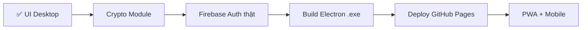

# 🎨 Báo Cáo Giao Diện Desktop — Ting! v1.0

> Ngày: 26/04/2026 | Trạng thái: ✅ Hoàn thiện Front-end Desktop

---

## 📊 Tổng Quan

| Hạng mục | Chi tiết |
|----------|---------|
| **Loại giao diện** | Desktop PC (Sidebar + Main Panel) |
| **Công nghệ** | Vanilla HTML/CSS/JS (không framework) |
| **Font** | Inter (Google Fonts) |
| **Tone màu** | Tím gradient (#6C5CE7 → #A29BFE) + Trắng premium |
| **Hiệu ứng** | 3D shadows, glassmorphism, hover animations |
| **Responsive** | Sidebar thu nhỏ < 900px |

---

## 📸 Screenshots Từng Trang

### 1. 🔑 Đăng Nhập — Split Screen
- **Trái:** Panel tím gradient + logo 3D + 4 feature highlights
- **Phải:** Form card — Google Sign-in / Email+Password / Đăng ký
- **Bonus:** Nút "🚀 Dùng thử không cần đăng nhập" (chế độ Demo)

### 2. 📊 Dashboard — Tổng Quan
- **4 Summary Cards:** Tổng TK | TK Mua | Sắp hết hạn | Đã hết hạn
- **Alert Banner:** Cảnh báo vàng "N tài khoản cần chú ý"
- **Account Grid:** Cards 3D, emoji nền tảng, badges trạng thái
- **Top Bar:** Search (Ctrl+K), Thông báo, Nút "+ Thêm TK"

### 3. 🛒 TK Mua — Danh Sách
- **Filter Tabs:** Tất cả | Hoạt động | Sắp hết | Đã hết
- **Grid Cards:** Logo, tên, username ẩn, ngày hết hạn, nút copy
- **Hover effect:** Card nổi lên + shadow đậm hơn

### 4. 🔒 Cá Nhân — Bảo Mật
- **Master Password Dialog:** Yêu cầu nhập trước khi xem
- **Cards:** Username + Password ẩn (••••••••), icon 🔒
- **Tất cả "Vĩnh viễn"** — không có ngày hết hạn

### 5. ⚙️ Cài Đặt
- **Bảo mật:** Đổi Master Password, Đổi mật khẩu đăng nhập
- **Thông báo:** Ngày báo trước (5,3,1), Gia hạn mặc định (30 ngày)
- **Dữ liệu:** Xuất JSON, Nhập JSON

### 6. 📋 Chi Tiết Tài Khoản
- **2-column layout:** Thông tin TK (trái) | Thời hạn & Gia hạn (phải)
- **Copy buttons:** TK, MK, 2FA
- **Gia hạn nhanh:** +7 / +15 / +30 / +90 / +365 ngày
- **Actions:** Sửa, Xoá

### 7. ➕ Thêm TK (Modal)
- **Smart Parser:** Dán text → tự tách TK/MK/2FA
- **Auto-detect:** Nhập "Netflix" → nhận diện nền tảng + emoji
- **Form:** Tên, Ngày mua, Ngày hết hạn, Checkbox vĩnh viễn, Ghi chú

---

## ✅ Checklist Tính Năng UI

| # | Tính năng | Trạng thái |
|---|-----------|:----------:|
| 1 | Sidebar dark gradient + logo + user info | ✅ |
| 2 | Navigation badges (số lượng TK) | ✅ |
| 3 | Top bar glassmorphism + search | ✅ |
| 4 | Summary cards 4 cột (hover 3D) | ✅ |
| 5 | Account grid cards (hover nổi) | ✅ |
| 6 | Filter tabs (Tất cả / Hoạt động / Sắp hết / Đã hết) | ✅ |
| 7 | Detail 2-column layout | ✅ |
| 8 | Master Password dialog | ✅ |
| 9 | Modal thêm TK + smart parse | ✅ |
| 10 | Toast notifications | ✅ |
| 11 | Keyboard shortcuts (Ctrl+K, Esc) | ✅ |
| 12 | Chế độ Demo (mock data 9 TK) | ✅ |
| 13 | Nút đăng xuất | ✅ |
| 14 | Responsive sidebar (< 900px) | ✅ |

---

## 🗂️ Cấu Trúc File

```
8. Ting!/
├── index.html              ← 🖥️ Desktop layout
├── firebase-config.js      ← Firebase project config
├── css/
│   ├── index.css           ← Design tokens (dùng chung)
│   ├── components.css      ← Component base (btn, input, card...)
│   ├── desktop.css         ← Desktop overrides + mở rộng
│   └── animations.css      ← Micro-animations
├── js/
│   ├── desktop-ui.js       ← Desktop renderer (render pages)
│   ├── desktop-app.js      ← Desktop logic + mock data + auth
│   ├── auth.js             ← Firebase Auth (dùng chung)
│   ├── db.js               ← Firestore CRUD (dùng chung)
│   ├── parser.js           ← Smart parser (dùng chung)
│   └── utils.js            ← Helpers (dùng chung)
├── mobile/                 ← 📱 Bản mobile (lưu riêng)
│   ├── index.html
│   ├── css/ (3 files)
│   └── js/ (ui.js, app.js)
├── assets/icons/
│   └── icon-512.png        ← Logo 3D
└── workflow/
    ├── ke_hoach_thuc_hien.md
    └── bao_cao_giao_dien.md  ← 📄 File này
```

---

## 💡 Gợi Ý Cải Tiến & Chỉnh Sửa

### 🎨 UI/UX — Nâng Cao Trải Nghiệm

| # | Gợi ý | Mức độ | Mô tả |
|---|-------|:------:|-------|
| 1 | **Dark Mode** | ⭐⭐ | Toggle sáng/tối trong Cài đặt. Sidebar đã dark, chỉ cần thêm biến CSS cho main panel |
| 2 | **Skeleton Loading** | ⭐ | Hiệu ứng "xương" khi đang tải data từ Firebase, thay vì trang trống |
| 3 | **Drag & Drop sắp xếp** | ⭐⭐ | Kéo thả cards để thay đổi thứ tự hiển thị |
| 4 | **Context Menu (chuột phải)** | ⭐⭐ | Click phải card → Copy TK / Copy MK / Sửa / Xoá |
| 5 | **Tooltip chi tiết** | ⭐ | Hover card → preview nhanh username + ngày hết hạn |
| 6 | **Favicon nền tảng thật** | ⭐⭐⭐ | Thay emoji bằng logo thật (Google S2 API: `https://www.google.com/s2/favicons?domain=netflix.com&sz=64`) |
| 7 | **Progress bar hết hạn** | ⭐ | Thanh tiến trình trên mỗi card cho biết % thời gian còn lại |
| 8 | **Lịch sử gia hạn** | ⭐⭐ | Timeline hiển thị các lần gia hạn trong trang Chi tiết |

### 🔒 Bảo Mật — Ưu Tiên Cao

| # | Gợi ý | Mức độ | Mô tả |
|---|-------|:------:|-------|
| 9 | **Auto-lock timer** | ⭐⭐⭐ | Tự khoá sau N phút không thao tác → yêu cầu Master Password lại |
| 10 | **Password Strength Meter** | ⭐⭐ | Hiển thị độ mạnh mật khẩu khi thêm TK mới |
| 11 | **Password Generator** | ⭐⭐⭐ | Tạo mật khẩu mạnh ngẫu nhiên (chọn độ dài, ký tự đặc biệt) |
| 12 | **2FA QR Code Viewer** | ⭐⭐ | Quét/hiển thị QR code cho OTP authenticator |

### 📊 Tính Năng Mở Rộng

| # | Gợi ý | Mức độ | Mô tả |
|---|-------|:------:|-------|
| 13 | **Biểu đồ chi phí** | ⭐⭐ | Dashboard hiển thị chart tổng chi phí subscription hàng tháng |
| 14 | **Nhóm/Tag** | ⭐⭐ | Phân loại TK theo nhóm: Giải trí, Công việc, Gia đình... |
| 15 | **Bulk Import** | ⭐ | Import nhiều TK cùng lúc từ CSV/JSON |
| 16 | **Chia sẻ TK** | ⭐⭐⭐ | Chia sẻ an toàn TK mua cho thành viên gia đình (qua link mã hoá) |
| 17 | **Lịch Calendar** | ⭐⭐ | View calendar hiển thị ngày hết hạn trên lịch tháng |
| 18 | **Multi-language** | ⭐ | i18n: Tiếng Việt / English toggle |

### 🖥️ Desktop Specific

| # | Gợi ý | Mức độ | Mô tả |
|---|-------|:------:|-------|
| 19 | **System Tray** | ⭐⭐⭐ | Khi build Electron — minimize xuống tray, notification popup |
| 20 | **Global Hotkey** | ⭐⭐ | Ctrl+Shift+T mở nhanh app từ bất cứ đâu |
| 21 | **Auto-start** | ⭐ | Tự chạy cùng Windows |
| 22 | **Window controls** | ⭐⭐ | Custom titlebar (min/max/close) thay vì Chrome default |

> [!TIP]
> **Ưu tiên gợi ý:** Nên làm trước #6 (favicon thật), #9 (auto-lock), #11 (password generator), #19 (system tray) vì mang lại giá trị cao nhất cho người dùng.

---

## 🚀 Bước Tiếp Theo



1. **`js/crypto.js`** — Mã hoá AES-256-GCM trước khi lưu Firebase
2. **Firebase Auth** — Test đăng nhập Google/Email thật
3. **Electron** — Wrap thành .exe cho Windows
4. **GitHub Pages** — Deploy bản web
5. **PWA manifest** — Cài trên mobile

---

*Cập nhật lần cuối: 26/04/2026 23:57*
